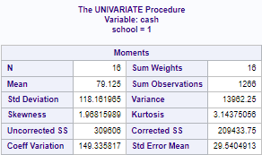
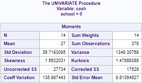
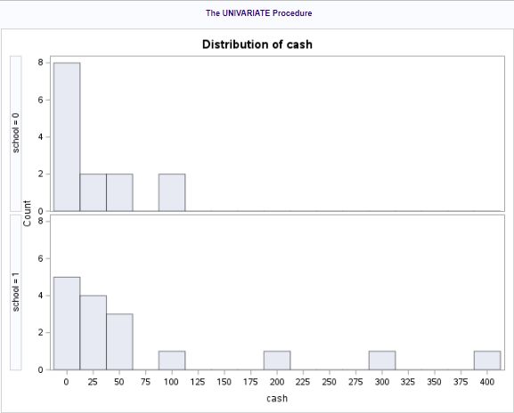

```{r setup, include=FALSE}
knitr::opts_chunk$set(echo = TRUE)
```

# 1: Randomized Experiment vs. Random Sample (from FLS 1)

A randomized experiment is one in which the participants are selected at random
from the population of interest (a random sample), and the allocation of test
subjects to treatment or control groups is also randomized (random assignment).
Conclusions drawn from such an experiment can make causal statements and can be
inferred to the population.

In an observational study you can't make causal inferences because you have no
ability to randomly assign the study participants to a treatment or control
group. Causal inferences are only made under randomized experiments. You can
make inferences to the population, but only if the study sample was randomly
selected from that population.

# 2: Literary Digest Presidential Poll (from FLS 1)

The desired population of interest for this study would be all eligible voters
in the United States. The three sample sources that Literary Digest used in the
survey didn't create a random sample, and likely skewed their results in favor
of Landon:

1. Subscribers to the magazine are a very small segment of the desired
population. They may have an ideological predisposition towards Landon, and they
may be economically distinct from the population at large (in that they could
afford to subscribe to a literary magazine in the middle of the Great
Depression).
2. Phone number records may have also biased the sample towards wealthier
voters, as phones were not as commonly-owned in 1936 as they would be in the
future.
3. Automobile registration may also have biased the sample towards wealthier
voters (again, car ownership was not as widespread in 1936 as it is today).

In all three sample sources, there is also an element of self-selection bias, in
that the poll was conducted by way of a mail-in postcard.

# 4: Scope of Inference for Fertilizer

### Study Design a): (from FLS 1)

In this study design the assignment of participants wasn't obtained randomly,
nor was the sample obtained randomly. There is selection bias in that farmers
opt in to purchasing the discounted fertilizer (they assign themselves to the
treatment or control group), and they also opt in to completing the crop yield
survey (they assign themselves to the sample). In the diagram on Page 9 of our
textbook, this study design is firmly located in the area in which we can make
no causal inferences to the sample, or inferences to the population.

### Study Design b): (from FLS 1)

This study design randomly assigns subjects to the treatment or control group,
but (as with the first study design) it introduces selection bias because the
farmers opt in to completing the crop yield survey. In the diagram on Page 9 of
our textbook, we see that causal inferences can be drawn, but we can't make
inferences to the population.

### Study Design c): 

This study design randomly assigns subjects to the treatment or control group
(by shipping the new or old fertilizer at random) and it randomly selects the
farmers whose crop yields are studied (not self-reported). Because it randomizes
both the sample selection and the allocation of participants, we can draw causal
inferences and infer them to the population.

### Study Design d):

In this study design, we randomly select the farmers whose crop yields are
studied, but farmers self-select into the treatment or control group by choosing
whether to purchase the new (discounted) fertilizer. Because the sample is
randomly selected we can make inferences to the population, but because the
allocation of participants is decidedly non-random we can't make any causal
statements.

# 5: Cash on Hand at SMU and Seattle U

### a) SAS Histogram

By using proc univariate in SAS to analyze the data from both
schools, we see that the mean cash on hand at SMU (School 1) is $79.125:



while the mean
cash on hand at Seattle U (School 0) is $27:



The difference in means is 52.125.

Viewing the below histogram, it's possible that this is driven by some outliers at SMU:



### b) R Histograms

Below is the example R code that we used to reproduce the histograms:

```{r}
SMU = c(34, 200, 23, 50, 60, 50, 0, 0, 30, 89, 0, 300, 400, 20, 10, 0)
Seattle = c(20, 10, 5, 0, 30, 50, 0, 100, 110, 0, 40, 10, 3, 0)
hist(SMU)
hist(Seattle)
```

# c) Permutation Test
A permutation test can show whether the difference in sample means between SMU
and Seattle (52.125) is statistically significant.

### Permutation Test in SAS

I did this in SAS by modifying the example code from the Creativity Study. This
code uses proc iml to "shuffle" our existing dataset 1000 times, and then
analyze the distribution of sample means from those 1000 new datasets.

I then filtered the set of 1000 sample means to see how many were as
extreme/more extreme than the findings from our original sample. The below log
output shows that 136 of 1000 permutations (13.6% of the permuted samples) had a
mean equal to or greater than 52.125. This is our one-sided p-value: .136.

### Permutation Test in R

For my conclusion, below, I use the p-value from SAS. But I also modified the
the example R code from the Creativity Study to run a second permutation test,
in an effort to better understand the code and to see if it gave me a wildly
different result.

```{r}
library(tidyverse)
# Read in Data
cash <- read.table(file.choose(),header = T,sep = ","); # This reads in the data.

xbars = cash %>% group_by(School) %>% summarize(mean = mean(Cash))
xbarNminusT = xbars[1,2] - xbars[2,2] # observed difference xbarSMU - xbarSeattle = 52.125
xbarNminusT

set.seed(2) # So we all get the same randomizations and thus the same values ... comment this out to see how the result changes based on the randomization.

# create variable to hold the difference in means for all of our sample distributions
xbarDiffHolder = numeric(10000)

# for loop runs 10000 times to "shuffle" the labels in our dataset, calculate the mean of the permuted dataset (grouped by school),
# calculate the difference between the two schools, and then store that difference in the xbarDiffHolder variable
for (i in 1:10000)
{
  scrambledLabels = sample(cash$School,30); #shuffle the Labels
  
  cashTemp = cash
  cashTemp$School = scrambledLabels
  
  xbars = cashTemp %>% group_by(School) %>% summarize(mean = mean(Cash))
  xbarNminusT = xbars[1,2] - xbars[2,2] # observed difference xbarIntrinsic - xbarExtrinsic = 21.16667
  xbarNminusT
  xbarDiffHolder[i] = xbarNminusT$mean
  
}

# create data from from xbarDiffHolder and generate a histogram showing the distribution of the difference of sample means
df = data.frame(xbarDiffs = xbarDiffHolder)

g = df %>% ggplot(mapping = aes(x = xbarDiffs)) + 
  geom_histogram(bins = 25, fill = "cornflowerblue", linewidth = 0.1) +
  ggtitle("Histogram of the Permutation Distribution of the Difference of Sample Means Scores")
g

# count how many differences of sample means from our 10000 permutations are greater than the observed difference from our original sample and store in the variable num_more_extreme
num_more_extreme = sum((abs(xbarDiffHolder)) >= 52.125)
num_more_extreme

# divide num_more_extreme by 10000, the number of permutations we created, to derive the p-value (which is the percentage of differences of sample means that were as extreme, or more extreme, than the observed difference)
pvalue = num_more_extreme / 10000
pvalue
```

The R code gave a p-value of .1456. As with the SAS test above, the p-value is
far greater than .05.

### Statistical Conclusion

As part of an investigation to see whether the school's vending machines should
accept bills and coins, students in a Business Stats class at SMU were polled to
see how much cash they had on hand at that very moment. A professor from Seattle
University conducted a similar poll the year before. We compared these two
samples to see whether there is any evidence that the mean cash on hand of SMU
students is different from the mean cash on hand of Seattle University students.
In our samples, the SMU mean pocket cash was $79.125, while the observed Seattle
U mean pocket cash was $27.

To determine whether the observed difference is statistically significant, we
conducted a permutation test. Our null hypothesis presumes that there is no
difference between the mean cash on hand between the two samples. Our
alternative hypothesis is that the mean between the two bodies would be
different.

H~0~: $\mu_{SMU} - \mu_{Seattle} = 0$

H~A~: $\mu_{SMU} - \mu_{Seattle} \neq 0$

The permutation test randomly generated 1000 possible arrangements of those
samples using the same data, but reassigning the amounts of cash on hand among
the test subjects at the two schools. We then calculated the difference of means
between those permuted samples and determined what proportion of those
permutations featured sample mean differences as extreme (or more extreme) as
ours. This proportion is our p-value.

p-value: .136

This is to say that, of 1000 randomly permuted samples, 13.6% of them exhibited
a difference in mean which was as extreme (or more extreme) than the difference
that we observed. To meet a 95% confidence level in our observed difference, we
would have needed to see a p-value of .05 or less.

Thus, our conclusion is that we fail to reject the null hypothesis: the data we
have isn't sufficient to suggest that there is a difference in the mean amount
of cash carried by students at SMU and Seattle U.

These findings are limited to the samples provided: we can't make inferences to
the general populations of these schools because the samples weren't drawn at
random. There are any number of confounding variables that could affect why the
mean pocket cash of students in a given Business Stats class might differ from
that of the student body at large. To make inferences to the larger population
we would need to randomly select students from each school to report the amount
of cash they have on hand, at which point we could analyze that data to see if a
statistically-significant difference in cash on hand would emerge.