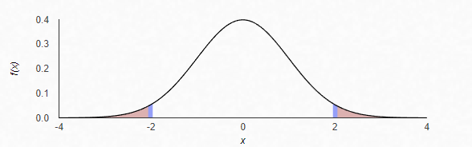

```{r setup, include=FALSE}
knitr::opts_chunk$set(echo = TRUE)
```

# 1: Quick Quiz Questions

1. a (true)
2. c (more accurate to say that the difference could plausibly be zero)
3. d (permutation test, though I imagine this means a lot of situations would
call for a permutation test)
4. The p-value is the likelihood that a result of a test statistic as extreme
(or more extreme) than the one tested would occur due to pure chance.

# 2: Concept Check from 2.13 in Asynch (New Marketing Strategy)

### Question

Assume you wanted to test whether a new marketing strategy is increasing the
mean total sales per day. You sample days at random under the old marketing
system and 10 days at random under the new marketing system and record the mean
sales for each group. You find that the 95 percent confidence interval for the
difference of mean sales per day (μ_new-μ_old) is ($1.23, $1.60). You note that
the new marketing strategy would cost $5.00 per day to implement. Is this result
statistically significant? Why? Is this study practically significant? Why?

### My Answer

This result is statistically significant if we found, with a 95% confidence
level, that the mean effect of the new marketing campaign would be between $1.23
and $1.60 per day in sales. However, that's not practically significant: our
benchmark for practical significance is to improve sales by more than the cost
of the new marketing campaign, and since this new campaign costs $5.00/day it
would be impractical to implement it at a loss of $3.40 - $3.77 per day.

# 3: CLT Activity from Section 2.2 of Asynch (Sleep 1 data)

1. 500 samples of size 5 yields a mean of 8.025 (close to the population mean of 8.001).
2. Values of the sample mean range from 5.24 to 10.21.
3. Standard Deviation of the sample mean is .657.
4. The distribution of sample means is symmetrical (a normal distribution) centered around 8 (the mean) with the majority of values very close to the center/mean (owing to the small standard deviation). 
5. Means and standard deviations of additional distributions:
a. For 500 samples of size 10, the mean was 7.960 and the standard deviation was .516
b. For 500 samples of size 20, the mean was 8.013 and the standard deviation was .332
c. For 500 samples of size 50, the mean was 8.024 and the standard deviation was .221
6. Shape of additional distributions:
a. Centered around the mean (approximately 8) and roughly symmetrical, but a much steeper curve than the samples of size 5.
b. Centered around the mean (approximately 8) and roughly symmetrical, but an even steeper curve than samples of size 10.
c. Centered around the mean (approximately 8) and roughly symmetrical, but the steepest curve yet! This large sample size really clusters our sample means around the actual mean of the population.

---

7. Sample standard deviations for additional distributions:
a. $$\frac{2.119}{\sqrt{10}} = 3.16227$$
b. $$\frac{2.119}{\sqrt{20}} = 4.47213$$
c. $$\frac{2.119}{\sqrt{50}} = 7.07106$$
8. The histograms of the smaller samples are much more scattered and random, but as the sample size increases the shape of the distribution becomes much closer to normal.
9. All of the distributions are roughly symmetric and have a mean that is close to that of the population (8) but as the sample size increases the shape of the distribution becomes a much steeper curve (the standard deviation gets smaller as the sample size increases). The original population shape is roughly normal, but these samples would also tend towards being normally distributed even if the underlying population were skewed, which is explained by the central limit theorem.
10. As the sample sizes get larger, the standard deviation of the distribution of sample means becomes smaller. 
11. As sample size increases, the means of those samples are more and more likely to be close to the underlying population mean.
12. Yes, this would hold true for samples taken of populations of any shape! It's truly mind-blowing, and something I'm still struggling to understand intuitively, but a sufficiently large sample of any population will be normally distributed and reflect the mean of that population; the shape of the sample means of multiple samples will be normally distributed; and the larger the sample, the more those sample means will be clustered around the population mean (the smaller the standard deviation). This is a powerful tool for unlocking the mean of a population from random sampling.
13. For reasons I don't understand, this seems to also be true of the median (based on looking at samples of the skewed College Midwest data). The standard deviation isn't the same as that of the population, but it's a function of the population standard deviation and gets smaller with larger samples. Dr. Sadler, why is the median the same??? 

# 4: Confidence Interval for Beachcomber Data

## Confidence Interval Question

1. I understand (in a very basic sense) that the confidence interval is constructed by taking the mean from the sample then adding and subtracting the standard error from it to give a range of plausible values. Is my understanding correct?

2. I'm having a hard time wrapping my mind around the standard error as a concept, but I feel like I'm getting closer to seeing how it all fits together.

# 5: American Samoa Discrimination Data

## 5a) Problem Statement

A lawsuit has claimed that the government of American Samoa has systematically discriminated against employees on the basis of age by preferentially firing older workers. A sample of 51 employees' ages and their employment status (either fired or not fired) showed that the mean age of the fired group was 1.9238 years older than the mean age of the group of employees who weren't fired. I used SAS to conduct both a permutation test to determine whether the observed age difference in this sample is statistically significant.

## 5a) Permutation Test: Identify H~0~ and H~a~

If we assume that the data would not show any discrimination on the basis of age, then our null hypothesis would be that the mean age of those who were fired was no different from the mean age of those who were fired. On the other hand, if age discrimination were evident in the data, the the mean age of those who are fired would be different from those who were not. Throughout this test, I refer to the those who were fired as being in Group 1, and those who were not fired as being in Group 0. We can express our hypotheses as:

### H~0~: $$\mu_1 - \mu_0 = 0$$

### H~a~: $$\mu_1 - \mu_0 \neq 0$$

## 5a) Permutation Test: Find P-Value

Using SAS, I simulated 1000 permutations of our sample data to construct a distribution of the mean differences from those samples. Of those 1000 sample means, 277 were as extreme (or more extreme) than our observed difference of 1.9238. This gives us a p-value of 0.277.

## 5a) Permutation Test: Statistical Conclusion and Scope of Inference

The P-Value of 0.277 indicates that we fail to reject the null hypothesis: there is not sufficient statistical evidence that the difference in mean ages between the sample group that was fired and the sample group that was not fired can be attributed to anything other than chance. Because this sample was randomly drawn from the population of interest (employees in the Government of American Samoa) we can infer that these findings are representative of the population. However, because this is not a truly randomized experiment (for obvious reasons: we can't do a controlled experiment in which we randomly fire people!) I can't make causal statements.

In the context of a legal proceeding, it is important to emphasize that a statistical test only shows that we can't rule out the possibility that there is no relationship between age and the likelihood of being fired. We can't make the claim that nobody was fired due to their age, or that there was no age-based discrimination. The standard of statistical significance is very specific and inherently different from the standards used to make decisions in a legal context. What we can state is that, based on this sample, we are 95% confident that we can't demonstrate statistical evidence that the difference in age can't be attributed to chance.

## 5b) T-Test Step 1: Identify H~0~ and H~a~

As was the case with the permutation test, we can express our hypotheses as:

### H~0~: $$\mu_1 - \mu_0 = 0$$

### H~a~: $$\mu_1 - \mu_0 \neq 0$$

## 5b) T-Test Step 2: Find the Critical Values and Draw and Shade

I was able to calculate our critical value using SAS, which found it to be 2.00758. This means that to meet the threshold of statistical significance our test statistic would need to be more extreme than +/- 2.00758 (which would be located in the shaded region below).



## 5b) T-Test Step 3: Find the Test Statistic

SAS calculated the t-value for our sample, which is -1.10. We can surmise that our t-value is not located within the shaded region to the left or right of our critical values.

## 5b) T-Test Step 4: Find the P-Value

SAS calculated the p-value for our sample, which is .2771. This means that there is a 27.71% chance of observing, by random chance, a result as extreme or more extreme than the observed difference in mean. 

## 5b) T-Test Step 5: Reject or Fail to Reject H~0~

Given that our desired confidence level is 95%, we would need to see a p-value less than (or equal to) .05 to reject the null hypothesis. Thus, our p-value of .2771 leads us to fail to reject the null hypothesis.

## 5b) T-Test Step 6: Statistical Conclusion and Scope of Inference

As noted in the permutation test above, the P-Value of 0.277 indicates that we fail to reject the null hypothesis: there is not sufficient statistical evidence that the difference in mean ages between the sample group that was fired and the sample group that was not fired can be attributed to anything other than chance. Because this sample was randomly drawn from the population of interest (employees in the Government of American Samoa) we can infer that these findings are representative of the population. However, because this is not a truly randomized experiment I can't make causal statements.

It is again worth emphasizing that this merely means that there isn't sufficient statistical evidence in our sample to say, with a 95% level of confidence, that the difference in means between the "fired" group and the "not fired" group is not zero. This doesn't mean that there is no age-based discrimination in this case, only that we didn't find statistical evidence to support it, and the standard of proof in a legal case will involve far more evidence (and different modes of judgment) than the relatively narrow scope of our statistical analysis.

## 5c) Comparing P-Value from Permutation Test and T-Test

The p-values were practically identical! .277 for the permutation test, and .2771 for the t-test. Is this because the age of the underlying population is normally distributed?

## 5d) Confidence Interval for Difference of Means

The permutation test gave a 95% confidence interval of -5.4413 to	1.5936. The t-test gave a 95% confidence interval of -5.4413 to 1.5936. This means that we are 95% certain that the difference in mean age between the "fired" and "not fired" group ranges between -5.4413 (meaning that the mean age of the "fired" group is 5.4413 years older than the "fired" group) and 1.5936 (meaning that the mean age of the "not fired" group is 1.5936 years older than the "fired" group). Because 0 is within our confidence interval, we can't rule out that there is no difference in mean age between the groups. 

## 5e) Pooled Standard Deviation and Standard Error

### Pooled Standard Deviation

$$s_p = \sqrt{\frac{(21 - 1)(6.5214)^2 + (30 - 1)(5.8835)^2}{21 + 30 - 2}} = 6.1519$$

### Standard Error of $$\bar{X}_{\text{Fired}} - \bar{X}_{\text{Not Fired}}$$

$$SE = 6.1519 \times \sqrt{\frac{1}{21} + \frac{1}{30}} = 1.7500$$

## 5f) T-Test in R

As shown below, the R code for this t-test gave the same results as SAS.

```{r}
Fired = c(34, 37, 37, 38, 41, 42, 43, 44, 44, 45, 45, 45, 46, 48, 49, 53, 53, 54, 54, 55, 56)
Not_fired = c(27, 33, 36, 37, 38, 38, 39, 42, 42, 43, 43, 44, 44, 44, 45, 45, 45, 45, 46, 46, 47, 47, 48, 48, 49, 49, 51, 51, 52, 54)
t.test(x = Fired, y = Not_fired, conf.int = .95, var.equal = TRUE, alternative = "two.sided")
```

# 6: Takeaways

1. The difference of means from two different groups in the same sample can be tested for statistical significance to give a measure of certainty about those differences.
2. A t-test can be used to test for statistical significance for a mean or the difference of means, and relies upon determining the p-value for a statistic (the percentage of expected outcomes that would be as extreme or more extreme than the observed mean if it were determined entirely by chance).
3. Hypothesis tests using t-tests are constructed by assuming that the observed effect doesn't exist (the null hypothesis) and testing the probability that this is not the case (the alternative hypothesis).
4. There is a difference between statistical significance and practical significance: large sample sizes can produce very low p-values for small differences in mean, and the threshold for practical significance (e.g., are we ready to spend money on this marketing campaign?) can vary greatly from the standard for statistical significance. As data scientists we need to take care in how we communicate results so stakeholders can be more informed in their decision-making.

# 7: Questions

1. In the discrimination tests, why did the permutation test and t-test give the same results? When would we use one test or another? 
2. In 5d) I got lost interpreting the confidence level of the difference of mean age, did I interpret that correctly?
3. Conceptually, I am having a hard time understanding what the critical value, the t-value, standard error, and pooled standard deviation actually mean. I can calculate them, but I can't really explain them well.
