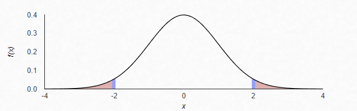

```{r setup, include=FALSE}
knitr::opts_chunk$set(echo = TRUE)
```

# 1: Bumblebee Bats

## 1a) T-Test in SAS

### Step 1: Problem Statement / Identify H~0~ and H~a~

Given the weights from a sample of 15 bumblebee bats with an observed mean weight of 1.6467. I will test whether they are from a population whose mean weight is equal to 1.8 grams. I will assume that the mean weight is 1.8 for my null hypothesis, and use a t-test on the sample data to determine whether that hypothesis is plausible. Our alternative hypothesis is that the sample bats were taken from a population with a mean weight not equal to 1.8, which is consistent with the observed data.

#### H~0~: $$\mu = 1.8$$

#### H~a~: $$\mu \neq 1.8$$

#### Step 2: Find the Critical Values and Draw and Shade

I was able to calculate our critical value using SAS, which found it to be 2.14478. 


This means that to meet the threshold of statistical significance our test statistic would need to be more extreme than +/- 2.14478 (which would be located in the shaded region below).


### Step 3: Find the Test Statistic

SAS calculated the t-value for our sample, which is -2.35. We can surmise that our t-value is located within the shaded region to the left of our critical value.

### Step 4: Find the P-Value

SAS calculated the p-value for our sample, which is .0342. This means that there is a 3.42% chance of observing, by random chance, a result as extreme or more extreme than the observed mean weight (which was 1.6467). 

### Step 5: Reject or Fail to Reject H~0~

Given that our desired confidence level is 95%, we would need to see a p-value less than (or equal to) .05 to reject the null hypothesis. Thus, our p-value of .0342 leads us to reject the null hypothesis.

### Step 6: Statistical Conclusion and Scope of Inference

We reject the null hypothesis: there is sufficient statistical evidence that the mean weight of the population from which the sample bats were taken is not equal to 1.8 grams. Because this sample was randomly drawn from the population of interest (employees in the Government of American Samoa) we can infer that these findings are representative of the population. 

## 1b) T-Test in R

```{r}
sample = c(1.7, 1.6, 1.5, 2.0, 2.3, 1.6, 1.6, 1.8, 1.5, 1.7, 1.2, 1.4, 1.6, 1.6, 1.6)
t.test(x=sample, mu = 1.8, conf.int = "TRUE", alternative = "two.sided")
```

---

# 2: American Samoa Discrimination Data

## 2a) Problem Statement and Permutation Test

A lawsuit has claimed that the government of American Samoa has systematically discriminated against employees on the basis of age by preferentially firing older workers. A sample of 51 employees' ages and their employment status (either fired or not fired) showed that the mean age of the fired group was 1.9238 years older than the mean age of the group of employees who weren't fired. I used SAS to conduct both a permutation test to determine whether the observed age difference in this sample is statistically significant.

If we assume that the data would not show any discrimination on the basis of age, then our null hypothesis would be that the mean age of those who were fired was no different from the mean age of those who were fired. On the other hand, if age discrimination were evident in the data, the the mean age of those who are fired would be different from those who were not. Throughout this test, I refer to the those who were fired as being in Group 1, and those who were not fired as being in Group 0. We can express our hypotheses as:

### H~0~: $$\mu_1 - \mu_0 = 0$$

### H~a~: $$\mu_1 - \mu_0 \neq 0$$

Using SAS, I simulated 1000 permutations of our sample data to construct a distribution of the mean differences from those samples. Of those 1000 sample means, 277 were as extreme (or more extreme) than our observed difference of 1.9238. This gives us a p-value of 0.277.

The P-Value of 0.277 indicates that we fail to reject the null hypothesis: there is not sufficient statistical evidence that the difference in mean ages between the sample group that was fired and the sample group that was not fired can be attributed to anything other than chance. Because this sample was randomly drawn from the population of interest (employees in the Government of American Samoa) we can infer that these findings are representative of the population. However, because this is not a truly randomized experiment (for obvious reasons: we can't do a controlled experiment in which we randomly fire people!) I can't make causal statements.

In the context of a legal proceeding, it is important to emphasize that a statistical test only shows that we can't rule out the possibility that there is no relationship between age and the likelihood of being fired. We can't make the claim that nobody was fired due to their age, or that there was no age-based discrimination. The standard of statistical significance is very specific and inherently different from the standards used to make decisions in a legal context. What we can state is that, based on this sample, we are 95% confident that we can't demonstrate statistical evidence that the difference in age can't be attributed to chance.

## 2b) T-Test 

### Step 1: Identify H~0~ and H~a~

As was the case with the permutation test, we can express our hypotheses as:

#### H~0~: $$\mu_1 - \mu_0 = 0$$

#### H~a~: $$\mu_1 - \mu_0 \neq 0$$

#### Step 2: Find the Critical Values and Draw and Shade

I was able to calculate our critical value using SAS, which found it to be 2.00758. This means that to meet the threshold of statistical significance our test statistic would need to be more extreme than +/- 2.00758 (which would be located in the shaded region below).



### Step 3: Find the Test Statistic

SAS calculated the t-value for our sample, which is -1.10. We can surmise that our t-value is not located within the shaded region to the left or right of our critical values.

### Step 4: Find the P-Value

SAS calculated the p-value for our sample, which is .2771. This means that there is a 27.71% chance of observing, by random chance, a result as extreme or more extreme than the observed difference in mean. 

### Step 5: Reject or Fail to Reject H~0~

Given that our desired confidence level is 95%, we would need to see a p-value less than (or equal to) .05 to reject the null hypothesis. Thus, our p-value of .2771 leads us to fail to reject the null hypothesis.

### Step 6: Statistical Conclusion and Scope of Inference

As noted in the permutation test above, the P-Value of 0.277 indicates that we fail to reject the null hypothesis: there is not sufficient statistical evidence that the difference in mean ages between the sample group that was fired and the sample group that was not fired can be attributed to anything other than chance. Because this sample was randomly drawn from the population of interest (employees in the Government of American Samoa) we can infer that these findings are representative of the population. However, because this is not a truly randomized experiment I can't make causal statements.

It is again worth emphasizing that this merely means that there isn't sufficient statistical evidence in our sample to say, with a 95% level of confidence, that the difference in means between the "fired" group and the "not fired" group is not zero. This doesn't mean that there is no age-based discrimination in this case, only that we didn't find statistical evidence to support it, and the standard of proof in a legal case will involve far more evidence (and different modes of judgment) than the relatively narrow scope of our statistical analysis.

## 2c) Comparing P-Value from Permutation Test and T-Test

The p-values were practically identical! .277 for the permutation test, and .2771 for the t-test. Is this because the age of the underlying population is normally distributed?

## 2d) Confidence Interval for Difference of Means

The permutation test gave a 95% confidence interval of -5.4413 to	1.5936. The t-test gave a 95% confidence interval of -5.4413 to 1.5936. This means that we are 95% certain that the difference in mean age between the "fired" and "not fired" group ranges between -5.4413 (meaning that the mean age of the "fired" group is 5.4413 years older than the "fired" group) and 1.5936 (meaning that the mean age of the "not fired" group is 1.5936 years older than the "fired" group). Because 0 is within our confidence interval, we can't rule out that there is no difference in mean age between the groups. 

## 2e) Pooled Standard Deviation and Standard Error

### Pooled Standard Deviation

$$s_p = \sqrt{\frac{(21 - 1)(6.5214)^2 + (30 - 1)(5.8835)^2}{21 + 30 - 2}} = 6.1519$$

### Standard Error of $$\bar{X}_{\text{Fired}} - \bar{X}_{\text{Not Fired}}$$

$$SE = 6.1519 \times \sqrt{\frac{1}{21} + \frac{1}{30}} = 1.7500$$

## 2f) T-Test in R

As shown below, the R code for this t-test gave the same results as SAS.

```{r}
Fired = c(34, 37, 37, 38, 41, 42, 43, 44, 44, 45, 45, 45, 46, 48, 49, 53, 53, 54, 54, 55, 56)
Not_fired = c(27, 33, 36, 37, 38, 38, 39, 42, 42, 43, 43, 44, 44, 44, 45, 45, 45, 45, 46, 46, 47, 47, 48, 48, 49, 49, 51, 51, 52, 54)
t.test(x = Fired, y = Not_fired, conf.int = .95, var.equal = TRUE, alternative = "two.sided")
```

# 3: Student Cash on Hand

## 3a) T-Test in R

```{r}
smu = c(34, 1200, 23, 50, 60, 50, 0, 0, 30, 89, 0, 300, 400, 20, 10, 0)
seattle_u = c(20, 10, 5, 0, 30, 50, 0, 100, 110, 0, 40, 10, 3, 0)
t.test(x = smu, y = seattle_u, conf.int = .95, var.equal = TRUE, alternative = "two.sided")
```

### Step 1: Problem Statement / Identify H~0~ and H~a~

As part of an investigation to see whether the school's vending machines should
accept bills and coins, students in a Business Stats class at SMU were polled to
see how much cash they had on hand at that very moment. A professor from Seattle
University conducted a similar poll the year before. 

I compared these two samples to see whether there is any evidence that the mean cash on hand of SMU
students is different from the mean cash on hand of Seattle University students.
In our samples, the SMU mean pocket cash was $141.625, while the observed Seattle
U mean pocket cash was $27, for an observed mean difference of $114.625.

Our null hypothesis is that there is no difference in the mean pocket cash of SMU students vs. Seattle University students. The alternative hypothesis is that there is a difference between the two populations (as shown in the sample data).

#### H~0~: $$\mu_{\text{SMU}} - \mu_{\text{Seattle U}} = 0$$

#### H~a~: $$\mu_{\text{SMU}} - \mu_{\text{Seattle U}} \neq 0$$

#### Step 2: Find the Critical Values and Draw and Shade

I was able to calculate our critical value using R, which found it to be 2.048407. 

```{r}
degrees_freedom = ((length(smu) - 1) + (length(seattle_u) - 1))
qt(.975, degrees_freedom)
```
This means that to meet the threshold of statistical significance our test statistic would need to be more extreme than +/- 2.048407 (which would be located in the shaded region below).


### Step 3: Find the Test Statistic

R calculated the t-value for our sample, which is 1.3976. We can surmise that our t-value is not located within the shaded region to the left or right of our critical value.

### Step 4: Find the P-Value

R calculated the p-value for our sample, which is .1732. This means that there is a 17.32% chance of observing, by random chance, a result as extreme or more extreme than the observed mean difference (which was 114.625). 

### Step 5: Reject or Fail to Reject H~0~

Given that our desired confidence level is 95%, we would need to see a p-value less than (or equal to) .05 to reject the null hypothesis. Thus, our p-value of .1732 leads us to fail to reject the null hypothesis.

### Step 6: Statistical Conclusion and Scope of Inference

We fail to reject the null hypothesis: there is not sufficient statistical
evidence to suggest that there is a difference in the mean cash on hand between
the populations of the two schools. These findings are limited to the samples
provided: we can't make inferences to the general populations of these schools
because the samples weren't drawn at random. There are any number of confounding
variables that could affect why the mean pocket cash of students in a given
Business Stats class might differ from that of the student body at large. To
make inferences to the larger population we would need to randomly select
students from each school to report the amount of cash they have on hand, at
which point we could analyze that data to see if a statistically-significant
difference in cash on hand would emerge.

## 3b) Comparison of this p-value vs. permutation test p-value

The p-value given by R for the t-test was .1732, while the p-value given by R for our permutation test (last week) was .136. I believe this is because the t-test makes more assumptions about the distribution of the underlying population. Our t-test assumes equal variance between the two samples, and the shape/skewness of them needs to be similar for a t-test to remain valid. I obviously have an imperfect understanding of this but I have looked ahead at Unit 3 a little bit. Examining this in detail would be beyond the scope of this question, but I have a feeling we will get to do some of that next week!
