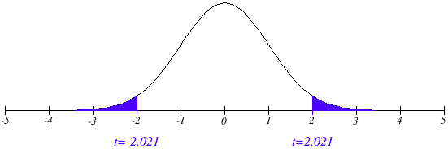
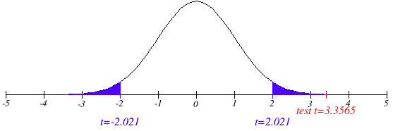
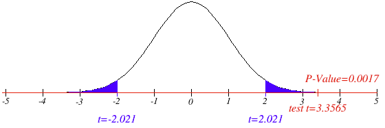

```{r setup, include=FALSE}
knitr::opts_chunk$set(echo = FALSE, warning = FALSE, message = FALSE, results = "hide")
library(dplyr)
library(ggplot2)
library(ggthemes)
library(scales)
```

# Question 1: Quick Quiz Questions

1. d
2. a and b
3. false (you can't take the log of a negative number)
4. b

# Question 2: Reaction Time Experiment

```{r}
# read in data
twitch = read.csv("twitch.csv", header = TRUE)
head(twitch)
summary(twitch)

# calculate critical values
df = nrow(twitch) - 1
qt(.975, df)

# paired t-test
t.test(x = twitch$Ritalin, y = twitch$Placebo, paired = TRUE)
```

## Step 1: Problem Statement / Identify H~0~ and H~a~

In an effort to test whether Ritalin slows reaction time, an experiment was conducted in which 41 participants were subjected to a periodic blast of sound via headphones, and the speed with which their eyes twitched in response to that sound was measured. The participants were recruited via newspaper ad and paid for their participation. The participants each came to the research site twice: on one visit they received a Ritalin treatment, and on the other they received a placebo. Neither participant nor researchers knew whether they were in the Ritalin or placebo group on a given visit.

---

To test whether Ritalin has any effect on the twitch time of the study participants, we will use a paired t-test. This mitigates the lack of independence in our sample and allows us to compare the mean difference between the Ritalin reactions and the placebo reaction. Since the observed data showed a mean difference of 0.09447, our null hypothesis will assume no difference, and the t-test will test the alternative hypothesis, that there is a difference between the means of the two groups. 

#### H~0~: $$\mu_r - \mu_p = 0$$

#### H~a~: $$\mu_r - \mu_p \neq 0$$

## Step 2: Find the Critical Values and Draw and Shade

```{r}
# calculate critical values
df = nrow(twitch) - 1
qt(.975, df)
```

I was able to calculate our critical value using R, which found it to be 2.021. This means that to meet the threshold of statistical significance our test statistic would need to be more extreme than +/- 2.021 (which would be located in the shaded region below).



## Step 3: Find the Test Statistic

```{r}
# paired t-test
t.test(x = twitch$Ritalin, y = twitch$Placebo, paired = TRUE)
```

Using a paired t-test in R, we find the test statistic to be 3.3565, which we can see is well within the shaded region to the right of our critical value.



## Step 4: Find the P-Value

R calculated the p-value for our sample, which is 0.00174. This means that there is a 0.174% chance of observing, by random chance, a result as extreme or more extreme than the observed mean difference.



## Step 5: Reject or Fail to Reject H~0~

Given that our desired confidence level is 95%, we would need to see a p-value less than (or equal to) .05 to reject the null hypothesis. Our p-value (0.00174) is well below that threshold, so we reject the null hypothesis.

## Step 6: Statistical Conclusion and Scope of Inference

This data shows strong evidence to suggest that there is a difference in reaction time between the Ritalin and Placebo groups, with a p-value of 0.00174. We are 95% confident that the mean difference in reaction times between the Placebo group and Ritalin group is between 0.03758528 and 0.15135473.

Because the test subjects were randomly allocated to the treatment group (in a double blind experiment) we can say that the evidence suggests a causal effect of the Ritalin treatment in decreasing reaction time. 

However, these findings are limited to the sample participants. These subjects self-selected into the sample by responding to a newspaper ad promising compensation for participation. The sample wasn't randomly chosen, which introduces the opportunity for any number of confounding variables, so we can't make inferences to the population based on the experiment. The strong treatment effect demonstrated does indicate that further experiments, with truly randomized samples, might be useful avenues for research.

# Question 3: Education and Income

```{r}
education = read.csv("EducationData.csv", header = TRUE)
summary(education)
```

Given a sample of education and income data, we want to test whether there is a difference in mean income between people who have 12 or 16 years of education. We must first examine the data's distribution to see which test is appropriate.

The summary of the data, and following histograms, show that the distributions of the two samples are not normal (they are both right-skewed), and the samples have substantially different standard deviations and sample sizes. Thus, an ordinary t-test would not be valid.    

```{r, echo = TRUE, results = "markup"}
education %>% group_by(Educ) %>% summarize(mean_income = mean(Income2005), sd_income = sd(Income2005), count = n())
```

---

```{r}
education %>% ggplot(aes(x = Income2005)) +
  geom_histogram(color = "blue") +
  facet_wrap(~Educ) +
  theme_economist() +
  scale_x_continuous(labels = scales::comma) +
  labs(
    title = "Income Distribution by Education Level",
    x = "Income",
    y = "Education Level"
  )
```

---

A logarithmic transformation can be used to create a more normal distribution upon which to run our t-test. The below summary and following histograms show the effect of this transformation. The summary of the data, and the following histograms, show the two sample distributions to be much less skewed, and much closer in spread.

```{r, echo = TRUE, results = "markup"}
# logarithmic transformation on income
education_log = education %>% mutate(log_income = log(Income2005))
head(education_log)
education_log %>% group_by(Educ) %>% summarize(mean_income = mean(log_income), sd_income = sd(log_income), count = n())
```

---

```{r}
education_log %>% ggplot(aes(x = log_income)) +
  geom_histogram(color = "blue") +
  facet_wrap(~Educ) +
  theme_economist() +
  scale_x_continuous(labels = scales::comma) +
  labs(
    title = "Log-Adjusted Income Distribution by Education Level",
    x = "Income",
    y = "Education Level"
  )
```


---

The pooled t-test on the log-transformed results shows a p-value of 2.2e-16 (0.00000000000000022), which is very strong evidence to reject the null hypothesis that there is no difference in mean income between those who completed either 12 or 16 years of education.

```{r, echo = TRUE, results = "markup"}
# pooled t-test stored as variable so we can extract and exponentiate the reported values from the confidence interval
log_test_result = t.test(log_income ~ Educ, data = education_log, var.equal = TRUE)
log_test_result
```

---

By reversing the log-transformation that we performed on the original income data, we can accurately report a confidence interval for the expected difference in income. We are 95% confident, based on this data, that the mean income of people with 12 years of education is between 51.08% to 62.62% of the mean income of people with 16 years of education.

Because this is an observational study (as it's impractical to randomly assign people to get 12 or 16 years of education), we can't make causal statements. However, because the samples were drawn at random (which I assume is implicit to this assignment) we can draw inferences to the population from which the data was drawn: employed people between 41 and 49 years of age.

```{r, echo = TRUE, results = "markup"}
# extracting lower and upper bounds from confidence interval and exponentiating them
# str(log_test_result)
lower_bound = log_test_result$conf.int[1]
upper_bound = log_test_result$conf.int[2]
reported_lower_bound = exp(lower_bound)
reported_upper_bound = exp(upper_bound)
reported_lower_bound
reported_upper_bound
```

---

For distributions which violate so many of the standard t-tests assumptions, Welch's t-test can also be used.

```{r, echo = TRUE, results = "markup"}
t.test(Income2005 ~ Educ, data = education, var.equal = FALSE)
```

This test also shows a p-value of 2.2e-16 (0.00000000000000022), which is also very strong evidence to reject the null hypothesis. Because the logarithm of the income data was normally distributed, it's an appropriate tool in this case. However, Welch's t-test is another option for data that might exhibit more variance even after a log transformation.

# Question 4: Takeaways

1. One can't use t-tests just because one wants to (and one knows how to code them). We first have to evaluate the assumptions of a t-distribution and check our data to make sure that it meets those assumptions. 
2. There are various factors that influence whether a t-test can still be considered robust/valid if those assumptions aren't met (e.g., large sample sizes mitigate the effects of non-normal distributions). 
3. For data that has too much variance for a standard t-test, we need to consider transforming the data into a more normal distribution, or performing another test altogether. A paired t-test can be used to evaluate data when the assumption of independence isn't met, and Welch's t-test can be used for data with high variance.
4. Logarithmic transformations seem to be the most useful transformation, though there are others, and care must be taken when reporting the results of tests performed on log-transformed data. 
5. Screening data to determine which tests to use is related to exploratory data analysis. This process requires specific attention to the shape, spread, and skewness of data, and careful handling of outliers.

# Question 5: Questions

1. I don't know if I interpreted the results of my log transformation correctly. When I reversed the log transformation I expected to see something like 50000 - 65000, being the actual estimated differences in mean income. I know the difference isn't between $0.51 and $0.62 so I assume it had to be a proportion. I just don't know if that's right, or how to mentally connect those dots.
2. Not a question, but I would love to learn more of what your own approach is to EDA when looking to determine a t-test. I obviously don't have that strong of a mental checklist/intuition around the process, and I'm trying to learn.
3. Everything covered was pretty clear, it's a lot to absorb but that's on me!