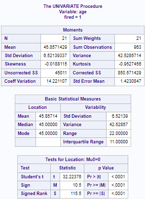
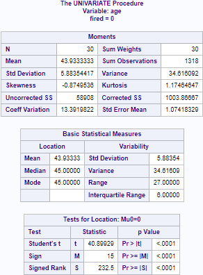
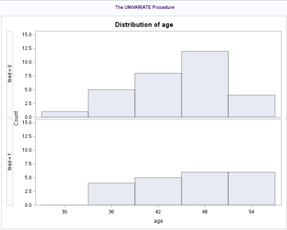

```{r setup, include=FALSE}
knitr::opts_chunk$set(echo = TRUE)
library(ggplot2)
library(dplyr)
library(ggthemes)
library(tidyverse)
```

# 1: Discrimination Data

## 1a: Assumptions of Two-Sample T-Test (in SAS)

Two analyze the discrimination data with respect to the assumptions of a two-sample t-test, I compared the distributions for the "Fired" group (Group 1 in the below tables and histogram) and the "Not Fired" group (shown below as Group 0). 







* __Normality:__ as shown in the above histogram, neither group is normally distributed. The "Not Fired" group is left-skewed, and the "Fired" group is almost uniform! This can create misleading results when using a t-test if the samples are small, as is the case here.
* __Standard Deviation:__ as shown in the above summary statistics, the two samples do not have the same standard deviation, which can create misleading results when the samples aren't the same size (as is the case here).
* __Independence__: by their nature, these samples are independent.
* __Outliers__: there do not seem to be an abundance of outliers in either group.
* __Other Assumptions:__ we are given that the samples were drawn at random, the observations are quantitative, and there is nothing in the question to indicate that the samples are not representative of the population from which they were chosen.

## 1b: Assumptions of Two-Sample T-Test (in R)

```{r}
discrimination = read.csv("discrimination.csv")
fired = discrimination %>% filter(fired == 1)
sd(fired$age)
hist(fired$age, main = "Distribution of Age - Fired", xlab = "Age")
not_fired = discrimination %>% filter(fired == 0)
sd(not_fired$age)
hist(not_fired$age, main = "Distribution of Age - Not Fired", xlab = "Age")
```

Though the different bins in the R histogram lead to slightly different visualizations, the general shape matches that shown in SAS, and the standard deviations match those shown by SAS.


## 1c) Complete Analysis of Data

### Permutation Test 1: Problem Statement

A lawsuit has claimed that the government of American Samoa has systematically discriminated against employees on the basis of age by preferentially firing older workers. A sample of 51 employees' ages and their employment status (either fired or not fired) showed that the mean age of the fired group was 1.9238 years older than the mean age of the group of employees who weren't fired. I used SAS to conduct both a permutation test to determine whether the observed age difference in this sample is statistically significant.

### Permutation Test 2: T-Test Assumptions

Because both samples aren't normally distributed, and because of the difference in standard deviations, a t-test isn't suitable. I will instead perform a permutation test. 

### Permutation Test 3: Identify H~0~ and H~a~

If we assume that the data would not show any discrimination on the basis of age, then our null hypothesis would be that the mean age of those who were fired was no different from the mean age of those who were fired. On the other hand, if age discrimination were evident in the data, the the mean age of those who are fired would be different from those who were not. Throughout this test, I refer to the those who were fired as being in Group 1, and those who were not fired as being in Group 0. We can express our hypotheses as:

#### H~0~: $$\mu_1 - \mu_0 = 0$$

#### H~a~: $$\mu_1 - \mu_0 \neq 0$$

### Permutation Test 3: Find P-Value

Using SAS, I simulated 1000 permutations of our sample data to construct a distribution of the mean differences from those samples. Of those 1000 sample means, 277 were as extreme (or more extreme) than our observed difference of 1.9238. This gives us a p-value of 0.277.

### Permutation Test 4 and 5: Statistical Conclusion and Scope of Inference

The P-Value of 0.277 indicates that there is not sufficient statistical evidence that the difference in mean ages between the sample group that was fired and the sample group that was not fired can be attributed to anything other than chance. Because this sample was randomly drawn from the population of interest (employees in the Government of American Samoa) we can infer that these findings are representative of the population. However, because this is not a truly randomized experiment (for obvious reasons: we can't do a controlled experiment in which we randomly fire people!) I can't make causal statements.

In the context of a legal proceeding, it is important to emphasize that a statistical test only shows that we can't rule out the possibility that there is no relationship between age and the likelihood of being fired. We can't make the claim that nobody was fired due to their age, or that there was no age-based discrimination. The standard of statistical significance is very specific and inherently different from the standards used to make decisions in a legal context. What we can state is that, based on this sample, we are 95% confident that we can't demonstrate statistical evidence that the difference in age can't be attributed to chance.

# 2: Student Cash on Hand

## 2a: Assumptions of Two-Sample T-Test (in R)

```{r}
cash = read.csv("Cash.csv")
cash %>% group_by(School) %>% summarize(mean = mean(Cash))
cash %>% group_by(School) %>% summarize(sd = sd(Cash))
cash %>% ggplot(aes(x = School, y = Cash)) +
  geom_boxplot(color = "blue") +
  labs(title = "Distributions of Cash on Hand", x = "School", y = "Cash") 
```

* __Normality:__ as shown in the above histogram, neither group is normally distributed: both are right-skewed, with SMU having a long tail.
* __Standard Deviation:__ R shows that the two samples do not have the same standard deviation, which can create misleading results when the samples aren't the same size (as is the case here).
* __Independence__: by their nature, these samples are independent.
* __Outliers__: as noted above, the SMU group has some outliers, including one with $1200 on hand!
* __Other Assumptions:__ the observations are quantitative, but there are issues with the way the samples were drawn and a question as to whether they are representative (discussed below in our conclusion)

## 2b: Complete Analysis

### Permutation Test 1: Problem Statement

As part of an investigation to see whether the school's vending machines should accept bills and coins, students in a Business Stats class at SMU were polled to see how much cash they had on hand at that very moment. A professor from Seattle University conducted a similar poll the year before. We compared these two samples to see whether there is any evidence that the mean cash on hand of SMU students is different from the mean cash on hand of Seattle University students. In our samples, the SMU mean pocket cash was $79.125, while the observed Seattle U mean pocket cash was $27.

### Permutation Test 2: T-Test Assumptions

Because both samples aren't normally distributed, and because of the difference in standard deviations, a t-test isn't suitable. I will instead perform a permutation test. 

### Permutation Test 3: Identify H~0~ and H~a~

To determine whether the observed difference is statistically significant, we conducted a permutation test. Our null hypothesis presumes that there is no difference between the mean cash on hand between the two samples. Our alternative hypothesis is that the mean between the two bodies would be different.

H~0~: $\mu_{SMU} - \mu_{Seattle} = 0$

H~A~: $\mu_{SMU} - \mu_{Seattle} \neq 0$

### Permutation Test 3: Find P-Value

The permutation test randomly generated 1000 possible arrangements of those samples using the same data, but reassigning the amounts of cash on hand among the test subjects at the two schools. We then calculated the difference of means between those permuted samples and determined what proportion of those permutations featured sample mean differences as extreme (or more extreme) as ours. This proportion is our p-value, which was found to be .1456.

This is to say that, of 1000 randomly permuted samples, 14.56% of them exhibited a difference in mean which was as extreme (or more extreme) than the difference that we observed. To meet a 95% confidence level in our observed difference, we would have needed to see a p-value of .05 or less.

### Permutation Test 4 and 5: Statistical Conclusion and Scope of Inference

Thus, our conclusion is that we fail to reject the null hypothesis: the data we have isn't sufficient to suggest that there is a difference in the mean amount of cash carried by students at SMU and Seattle U.

These findings are limited to the samples provided: we can't make inferences to the general populations of these schools because the samples weren't drawn at random. There are any number of confounding variables that could affect why the mean pocket cash of students in a given Business Stats class might differ from that of the student body at large. To make inferences to the larger population we would need to randomly select students from each school to report the amount of cash they have on hand, at which point we could analyze that data to see if a statistically-significant difference in cash on hand would emerge.

```{r}
xbars = cash %>% group_by(School) %>% summarize(mean = mean(Cash))
xbarNminusT = xbars[1,2] - xbars[2,2] # observed difference xbarSMU - xbarSeattle = 52.125
xbarNminusT

set.seed(2) # So we all get the same randomizations and thus the same values ... comment this out to see how the result changes based on the randomization.

# create variable to hold the difference in means for all of our sample distributions
xbarDiffHolder = numeric(10000)

# for loop runs 10000 times to "shuffle" the labels in our dataset, calculate the mean of the permuted dataset (grouped by school),
# calculate the difference between the two schools, and then store that difference in the xbarDiffHolder variable
for (i in 1:10000)
{
  scrambledLabels = sample(cash$School,30); #shuffle the Labels
  
  cashTemp = cash
  cashTemp$School = scrambledLabels
  
  xbars = cashTemp %>% group_by(School) %>% summarize(mean = mean(Cash))
  xbarNminusT = xbars[1,2] - xbars[2,2] # observed difference xbarIntrinsic - xbarExtrinsic = 21.16667
  xbarNminusT
  xbarDiffHolder[i] = xbarNminusT$mean
  
}

# create data from from xbarDiffHolder and generate a histogram showing the distribution of the difference of sample means
df = data.frame(xbarDiffs = xbarDiffHolder)

g = df %>% ggplot(mapping = aes(x = xbarDiffs)) + 
  geom_histogram(bins = 25, fill = "cornflowerblue", linewidth = 0.1) +
  ggtitle("Histogram of the Permutation Distribution of the Difference of Sample Means Scores")
g

# count how many differences of sample means from our 10000 permutations are greater than the observed difference from our original sample and store in the variable num_more_extreme
num_more_extreme = sum((abs(xbarDiffHolder)) >= 52.125)
num_more_extreme

# divide num_more_extreme by 10000, the number of permutations we created, to derive the p-value (which is the percentage of differences of sample means that were as extreme, or more extreme, than the observed difference)
pvalue = num_more_extreme / 10000
pvalue
```

# Question 3: Education and Income

```{r}
education = read.csv("EducationData.csv", header = TRUE)
summary(education)
```

## 3.1: Problem Statement

Given a sample of education and income data, we want to test whether there is a difference in mean income between people who have 12 or 16 years of education. We must first examine the data's distribution to see which test is appropriate.

## 3.2: T-Test Assumptions

The summary of the data, and following histograms, show that the distributions of the two samples are not normal (they are both right-skewed), and the samples have substantially different standard deviations and sample sizes. Thus, an ordinary t-test would not be valid.    

```{r}
education %>% group_by(Educ) %>% summarize(mean_income = mean(Income2005), sd_income = sd(Income2005), count = n())
```

```{r}
education %>% ggplot(aes(x = Income2005)) +
  geom_histogram(color = "blue") +
  facet_wrap(~Educ) +
  theme_economist() +
  scale_x_continuous(labels = scales::comma) +
  labs(
    title = "Income Distribution by Education Level",
    x = "Income",
    y = "Education Level"
  )
```

## 3.3: Perform Appropriate Test

A logarithmic transformation can be used to create a more normal distribution upon which to run our t-test. The below summary and following histograms show the effect of this transformation. The summary of the data, and the following histograms, show the two sample distributions to be much less skewed, and much closer in spread.

```{r}
# logarithmic transformation on income
education_log = education %>% mutate(log_income = log(Income2005))
head(education_log)
education_log %>% group_by(Educ) %>% summarize(mean_income = mean(log_income), sd_income = sd(log_income), count = n())
```

```{r}
education_log %>% ggplot(aes(x = log_income)) +
  geom_histogram(color = "blue") +
  facet_wrap(~Educ) +
  theme_economist() +
  scale_x_continuous(labels = scales::comma) +
  labs(
    title = "Log-Adjusted Income Distribution by Education Level",
    x = "Income",
    y = "Education Level"
  )
```

The pooled t-test on the log-transformed results shows a p-value of 2.2e-16 (0.00000000000000022), which is very strong evidence to reject the null hypothesis that there is no difference in mean income between those who completed either 12 or 16 years of education.

```{r}
# pooled t-test stored as variable so we can extract and exponentiate the reported values from the confidence interval
log_test_result = t.test(log_income ~ Educ, data = education_log, var.equal = TRUE)
log_test_result
```

## 3.4 and 3.5: Statistical Conclusion and Scope of Inference

By reversing the log-transformation that we performed on the original income data, we can accurately report a confidence interval for the expected difference in income. We are 95% confident, based on this data, that the mean income of people with 12 years of education is between 51.08% to 62.62% of the mean income of people with 16 years of education.

Because this is an observational study (as it's impractical to randomly assign people to get 12 or 16 years of education), we can't make causal statements. However, because the samples were drawn at random (which I assume is implicit to this assignment) we can draw inferences to the population from which the data was drawn: employed people between 41 and 49 years of age.

```{r}
# extracting lower and upper bounds from confidence interval and exponentiating them
# str(log_test_result)
lower_bound = log_test_result$conf.int[1]
upper_bound = log_test_result$conf.int[2]
reported_lower_bound = exp(lower_bound)
reported_upper_bound = exp(upper_bound)
reported_lower_bound
reported_upper_bound
```

For distributions which violate so many of the standard t-tests assumptions, Welch's t-test can also be used.

```{r}
t.test(Income2005 ~ Educ, data = education, var.equal = FALSE)
```

This test also shows a p-value of 2.2e-16 (0.00000000000000022), which is also very strong evidence to reject the null hypothesis. Because the logarithm of the income data was normally distributed, and because Welch's t-test is less powerful, the logarithmic transformation was the best tool to use in this case. However, Welch's t-test is another option for data that might exhibit more variance even after a log transformation.