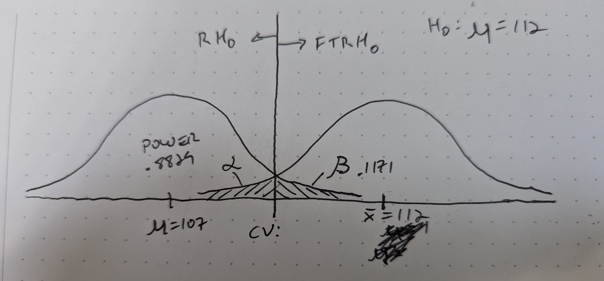
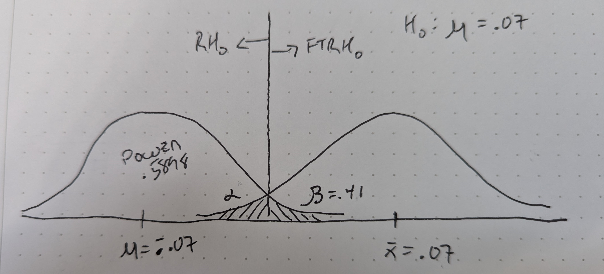
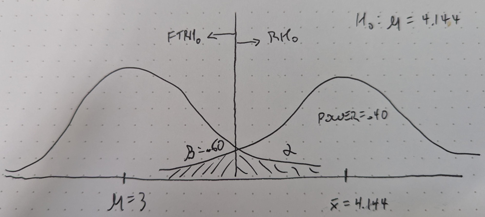

```{r setup, include=FALSE, echo=FALSE}
knitr::opts_chunk$set(echo = FALSE, warning = FALSE, message = FALSE, results = "hide")
library(dplyr)
library(ggplot2)
library(ggthemes)
library(scales)
```

# 1: Quick Quiz Questions

## QQQ 1

1. D
2. C
3. B
4. A
5. E

## QQQ 2

A, C, F, H

## QQQ 3

A t-test on the difference in means between the log income for the two groups would be more powerful. Welch's t-test is designed to account for samples with high variance, so it sacrifices some power to do so. In this case, since the log-transformed data produced normal distributions with similar variance and spread, we can use a pooled t-test which is more powerful.

# 2: Reaction Time Experiment

## Power Test in R

```{r, echo=TRUE}
power.t.test(n = 250, delta = 5, sd = 25, type = "paired", alternative = "two.sided", sig.level = .05)
```

## Answers

1. The probability that our test will make a mistake and reject the null hypothesis if it's true is alpha, or significance level, which is given as 0.05.
2. This would be a Type I error.
3. If the true mean is 107, then the effect size is 5.
4. The probability that our test will make the correct decision and reject the null hypothesis is 0.8829952.
5. "Power" is the statistical term for this value.

---



# 3: Recall the Reaction Time Experiment

## Power Test in R

```{r, echo=TRUE}
power.t.test(n = 41, delta = 0.07, sd = 0.2, type = "paired", alternative = "two.sided", sig.level = .05)
```

## Answers

1. The probability that our test will make a mistake and reject the null hypothesis if it's true is alpha, or significance level, which is given as 0.05.
2. The power would be .5898

---


3. Using the power.t.test() function in R, I was able to calculate the power of sample sizes between 60 and 80, and I also calculated the power for sample size 90, which would being us to the 90% power threshold.

```{r, echo=FALSE}
curve_60 = power.t.test(n = 60, delta = 0.07, sd = 0.2, type = "paired", alternative = "two.sided", sig.level = .05)
curve_65 = power.t.test(n = 65, delta = 0.07, sd = 0.2, type = "paired", alternative = "two.sided", sig.level = .05)
curve_70 = power.t.test(n = 70, delta = 0.07, sd = 0.2, type = "paired", alternative = "two.sided", sig.level = .05)
curve_75 = power.t.test(n = 75, delta = 0.07, sd = 0.2, type = "paired", alternative = "two.sided", sig.level = .05)
curve_80 = power.t.test(n = 80, delta = 0.07, sd = 0.2, type = "paired", alternative = "two.sided", sig.level = .05)
curve_85 = power.t.test(n = 85, delta = 0.07, sd = 0.2, type = "paired", alternative = "two.sided", sig.level = .05)
curve_90 = power.t.test(n = 90, delta = 0.07, sd = 0.2, type = "paired", alternative = "two.sided", sig.level = .05)
power_60 = curve_60$power
power_65 = curve_65$power
power_70 = curve_70$power
power_75 = curve_75$power
power_80 = curve_80$power
power_90 = curve_90$power
```

```{r, echo = TRUE}
cat("Power of sample size 60 = ", power_60, "\n")
cat("Power of sample size 65 = ", power_65, "\n")
cat("Power of sample size 70 = ", power_70, "\n")
cat("Power of sample size 75 = ", power_75, "\n")
cat("Power of sample size 80 = ", power_80, "\n")
cat("Power of sample size 90 = ", power_90, "\n")
```

# 4: Recall the Creativity Study

## Power Test in R

```{r, echo = TRUE}
creativity = read.csv("Creativity.csv")
grouped_means = creativity %>% group_by(Treatment_S) %>% 
  summarise(mean = mean(Score))
observed_difference = diff(grouped_means$mean)
observed_difference
power.t.test(n = nrow(creativity), delta = observed_difference - 3, sd = 4.5, type = "paired", alternative = "two.sided", sig.level = .05)
```

## Answers

1. The power would be .40006
2. See next slide.
3. As the true difference in means gets larger than the observed difference, delta increases, which will increase the power because it becomes less and less likely that an erroneous observed difference will fall in the plausible range of values for $\mu. However, for a true mean of 4, the power gets very small and I'm not sure why that is: since that value brings delta close to 0, I would expect it to result in a very large power because the observed mean is so close to the true mean.
4. As we see below, the power gets smaller when delta is 4, and grows again when delta is 5, getting very large when delta is 7.

```{r, echo = FALSE}
curve_3 = power.t.test(n = nrow(creativity), delta = observed_difference - 3, sd = 4.5, type = "paired", alternative = "two.sided", sig.level = .05)
curve_4 = power.t.test(n = nrow(creativity), delta = observed_difference - 4, sd = 4.5, type = "paired", alternative = "two.sided", sig.level = .05)
curve_5 = power.t.test(n = nrow(creativity), delta = observed_difference - 5, sd = 4.5, type = "paired", alternative = "two.sided", sig.level = .05)
curve_7 = power.t.test(n = nrow(creativity), delta = observed_difference - 7, sd = 4.5, type = "paired", alternative = "two.sided", sig.level = .05)
power_3 = curve_3$power
power_4 = curve_4$power
power_5 = curve_5$power
power_7 = curve_7$power
```

---



```{r}
cat("Power if true mean difference is 3 = ", power_3, "\n")
cat("Power if true mean difference is 4 = ", power_4, "\n")
cat("Power if true mean difference is 5 = ", power_5, "\n")
cat("Power if true mean difference is 7 = ", power_7, "\n")
```

# 5: Takeaways

1. A Type I error is one in which we reject H~0~ if it is true, and a Type II error is one in which we fail to reject H~0~ if it is false.
2. The probability of making a Type I error is alpha, and the probability of making a Type II error is Beta.
3. Power is the probability of rejecting H~0~ if it is false.
4. The difference between the observed mean and the true mean is delta. Higher delta values and higher sample sizes increase the power of a test.

# 6: Questions

1. I felt like I had this down cold until I got to the Creativity question and saw the power decrease when the true mean was 4 or 5. Why did that happen? 
2. I could generally use more context and explanation of the underlying formulas and how the variables relate. The lectures are awesome, I just benefit from repetition with math concepts, so I'm really looking forward to learning more about this tonight!
