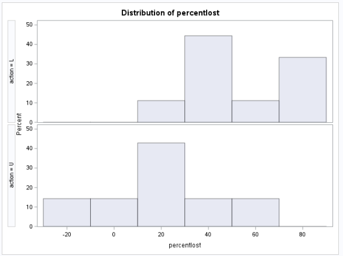
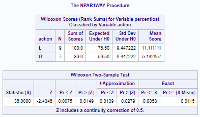
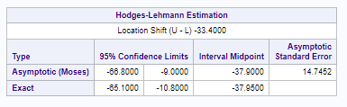

```{r setup, include=FALSE, echo=FALSE}
knitr::opts_chunk$set(echo = FALSE, warning = FALSE, message = FALSE, results = "hide")
library(dplyr)
library(ggplot2)
library(ggthemes)
library(scales)
```

# 1: Quick Quiz Questions

## Answers

1. A
2. C

# 2: Logging and Wildfires (rank-sum and permutation tests)

## Problem Statement and Hypotheses

The timber industry argues that logging burned trees enhances forest recovery after a wildfire, and the EPA argues the opposite. I analyzed data from the 2002 Biscuit Fire in Oregon to compare the percent of seedlings lost on logged (L) and unlogged (U) plots following the fire. 

The EPA asserts that logging would increase the number of seedlings lost in the years after the fire. Thus, our null hypothesis is that there is no difference between logged and unlogged plots, while our alternative hypothesis is that the percentage of seedlings lost would be higher in logged plots than in unlogged ones.

#### $$H_0: Median_l - Median_u = 0$$

#### $$H_a: Median_l - Median_u > 0$$

## Rank-Sum Test in SAS

As shown in this histogram, the distribution of data for these two groups is not normal, and there are some notable outliers in the unlogged group. This, combined with the small sample size, makes a t-test inappropriate. I used a rank-sum test because it is resistant to non-normal distribution and performs better than a t-test when there are extreme outliers.



---

As shown in these rank-sum results, for a one-sided t-test this data has a continuity-corrected p-value of .0075, which is sufficient to reject the null hypothesis, and a 95% confidence interval (exact) of -65.1 to -10.8.





## Statistical Conclusion

The continuity-corrected p-value of .0075 shows that there is sufficient evidence at the .05 level of significance to suggest that the median loss of seedlings in plots that were logged after a wildfire is greater than the percentage lost in unlogged plots. We are 95% confident that the median of the percent of seedlings lost is between 10.8% and 65.1% greater in logged plots than in unlogged plots.

## Rank-Sum Test in R

I confirmed the p-value and confidence interval in R; however, in order to get the same p-value in R that I got in SAS I had to set the "exact" flag to "FALSE." It's unclear why this is the case.

---

```{r, echo=TRUE, results='markup'}
logging = read.csv("Logging.csv", header = TRUE)
wilcox.test(PercentLost ~ Action, data = logging, exact = FALSE, conf.int = TRUE, alternative="greater")
```

---

```{r, echo=TRUE, results='markup'}
logging = read.csv("Logging.csv", header = TRUE)
wilcox.test(PercentLost ~ Action, data = logging, exact = TRUE, conf.int = TRUE, alternative="greater")
```

---

Similarly, I was unable to get the confidence intervals to match without removing the flag for a one-sided test.

---

```{r, echo=TRUE, results='markup'}
logging = read.csv("Logging.csv", header = TRUE)
wilcox.test(PercentLost ~ Action, data = logging, exact = FALSE, conf.int = TRUE, alternative="greater")
```

---

```{r, echo=TRUE, results='markup'}
logging = read.csv("Logging.csv", header = TRUE)
wilcox.test(PercentLost ~ Action, data = logging, exact = TRUE, conf.int = TRUE)
```

## Permutation Test in R

I also used a permutation test for the difference of means between two groups. Like a rank-sum test, the permutation test is resistant to non-normal distributions and outliers. Using Dr. Sadler's code, I generated 10000 random permutations of the original data. This provides a normal distribution of differences between the means of the permuted datasets, and allows us to compare differences between the data.

```{r}
logging <- read.csv("Logging.csv", header = TRUE)

number_of_permutations = 10000;
xbarholder = c();
counter = 0;
observed_diff = mean(subset(logging, Action == "L")$PercentLost)-mean(subset(logging, Action == "U")$PercentLost)
observed_diff
for(i in 1:number_of_permutations)
{
  scramble = sample(logging$PercentLost,16);
  L = scramble[1:9];
  U = scramble[10:16];
  diff = mean(L)-mean(U);
  xbarholder[i] = diff;
  if(diff >= observed_diff)
    counter = counter + 1;
  
}
hist(xbarholder, col = "lightblue", main = "Differences Means Under Ho", xlab = "Diff of Means");
abline(v = observed_diff,col = "red", lwd = 3);
pvalue = counter / number_of_permutations;
pvalue
```

---

The permutation test showed an observed mean difference of 38.10476 (meaning that the logged plots lost 38.10476 more seedlings than unlogged ones), with a p-value of .0048. There is sufficient evidence to suggest, with a .05 level of significance, that logging plots after a wildfire leads to a greater loss of seedlings than not logging them.

# Takeaways and Questions

## Takeaways

1. T-tools aren't always appropriate for analyzing data from non-normal distributions (that can't be handled by transformation), small sample sizes, or samples with extreme outliers. There are alternatives!
2. The permutation test is resistant to non-normality and small sample sizes. Because it is computationally-intensive it's most useful for small samples.
3. The rank-sum test (or Wilcoxon test) is also resistant to non-normality and small sample sizes, and can be effective at handling extreme outliers. Care must be taken when examining the results of a rank-sum test, because of the rank transformation. Its disadvantage is that it is difficult to compute confidence intervals.
4. The Levene Median Test can be used to determine whether the variance of two distributions is similar. 

## Questions

1. For homework purposes, what constitutes a "complete analysis" with a rank-sum test? In the FLS, I tried to demonstrate why a t-test isn't suitable for the data, but I wasn't sure about drawing and shading, and am generally trying to wrap my head around what the test statistic an p-value *mean* for a rank-sum test. I found a website with critical values for rank-sum but since it wasn't in our text and I wasn't clear on it I didn't include it. Short version: what is the equivalent of a "6 step" analysis for alternative tests?
2. I was baffled at why I was unable to get my p-value and confidence intervals to match between R and SAS (without disabling the "exact" option).
3. As with log transformations, I'm trying to conceptually understand how to interpret results/confidence intervals. Because SAS ran the test as "U - L" I reversed the values in my analysis. I need to work on being able to mentallyi link the results of the test to the real world, otherwise I'm just typing into an IDE. 