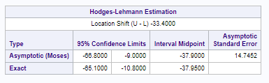

```{r setup, include=FALSE}
knitr::opts_chunk$set(echo = TRUE)

library(dplyr)
library(ggplot2)
library(ggthemes)
```

# 1: Reading and Textbook Questions

I completed these, homework instructions indicate that we shouldn't type them up.

# 2: Logging and Wildfire Recovery

## 2a: Complete Analysis in SAS (Rank Sum)

### Step 1: Problem Statement and Hypotheses

The timber industry argues that logging burned trees enhances forest recovery after a wildfire, and the EPA argues the opposite. I analyzed data from the 2002 Biscuit Fire in Oregon to compare the percent of seedlings lost on logged (L) and unlogged (U) plots following the fire. 

As shown in this histogram, the distribution of data for these two groups is not normal, and there are some notable outliers in the unlogged group. This, combined with the small sample size, makes a t-test inappropriate. I used a rank-sum test because it is resistant to non-normal distribution and performs better than a t-test when there are extreme outliers.


The EPA asserts that logging would increase the number of seedlings lost in the years after the fire. Thus, our null hypothesis is that there is no difference between logged and unlogged plots, while our alternative hypothesis is that the percentage of seedlings lost would be higher in logged plots than in unlogged ones.

#### $$H_0: Median_l - Median_u = 0$$

#### $$H_a: Median_l - Median_u > 0$$

### Step 2: Critical Value

Because I ran an exact test, I won't calculate the critical values.

### Step 3: Test Statistic

SAS calculates the test statistic Z to be -2.4346.

### Step 4: P-Value

As shown in these rank-sum results, for a one-sided t-test this data has a continuity-corrected p-value of .0075

### Step 5: Decision

The p-value of .0075 is sufficient to reject the null hypothesis,

### Step 5: Statistical Conclusion and Scope of Inference

There is strong evidence to suggest that the median difference in percentage of seedlings lost between logged and unlogged plots is positive (continuity-corrected p-value of .0075.) We can say, with a 95% confidence level, that logged plots lose between 10.8% and 65.1% more seedlings than unlogged parcels. 

Causal inferences can't be made because the treatment (of logging or not logging the parcels) wasn't assigned randomly: presumably, the logging companies chose their plots based on their suitability for logging, which introduces confounding variables. Further, because the plots themselves weren't chosen at random, we can't make inferences to the larger population of all areas affected by wildfires. However, the strong association shown in the data, combined with the nature of the problem (it is impractical to start wildfires randomly for the purpose of research) means that this could be a fruitful area for further investigation.




## Statistical Conclusion

The continuity-corrected p-value of .0075 shows that there is sufficient evidence at the .05 level of significance to suggest that the median loss of seedlings in plots that were logged after a wildfire is greater than the percentage lost in unlogged plots. We are 95% confident that the median of the percent of seedlings lost is between 10.8% and 65.1% greater in logged plots than in unlogged plots.

# 3: Welch's T-Test on Education Data

```{r}
education = read.csv("EducationData.csv", header = TRUE)
summary(education)
nrow(education)
```

## 3a: Problem Statement and T-Test Assumptions

Given a sample of education and income data, we want to test whether there is a difference in mean income between people who have 12 or 16 years of education. We must first examine the data's distribution to see which test is appropriate.

The summary of the data, and following histograms, show that the distributions of the two samples are not normal (they are both right-skewed), and the samples have substantially different standard deviations and sample sizes. Thus, an ordinary t-test would not be valid.    

```{r}
education %>% group_by(Educ) %>% summarize(mean_income = mean(Income2005), sd_income = sd(Income2005), count = n())
```

```{r}
education %>% ggplot(aes(x = Income2005)) +
  geom_histogram(color = "blue") +
  facet_wrap(~Educ) +
  theme_economist() +
  scale_x_continuous(labels = scales::comma) +
  labs(
    title = "Income Distribution by Education Level",
    x = "Income",
    y = "Education Level"
  )
```

## 3a, b, c and d: Six-Step Analysis

### Step 1: Problem Statement

Given a sample of education and income data, we want to test whether there is a difference in mean income between people who have 12 or 16 years of education. The data shows an observed difference in mean income of $34,887.07 between those with 16 years of education and those with 12 years of education. Thus, our null hypothesis is that there is no difference in mean income, and the alternative hypothesis is that there is a difference.

#### H~0~: $$\mu_{16} - \mu_{12} = 0$$

#### H~a~: $$\mu_{16} - \mu_{12} \neq 0$$

Do to the violations of normality and variance in this data, I will use Welch's T-Test.

```{r}
test = t.test(Income2005 ~ Educ, data = education, var.equal = FALSE)
str(test)
print(test)
```


### Step 2: Critical Value

Using R, we can calculate the critical value for a .05 level of significance:

```{r}
df = test$parameter
qt(.025, df = df)
```

### Step 3: Value of T-Statistic

The value of our test statistic is:

```{r}
test$statistic
```

### Step 4: P-Value

The p-value is:

```{r}
test$p.value
```

### Step 5: Decision

The p-value of 1.993584e-21 is far, far below .05, so we reject the null hypothesis.

### Step 6: Statistical Conclusion and Scope of Inference

There is strong evidence (p-value of 1.993584e-21) to suggest that the mean difference in income between people with 16 and 12 years of education is not zero. We can say, with 95% confidence, that the true mean difference in income between the two groups is between 39653.77 and 26610.39.

Because this is an observational study (as it's impractical to randomly assign people to get 12 or 16 years of education), we can't make causal statements. However, because the samples were drawn at random (which I assume is implicit to this assignment) we can draw inferences to the population from which the data was drawn: employed people between 41 and 49 years of age.

## 3e: Test on Log-Transformed Data vs. Welch's T-Test

I would prefer to run a test on the log-transformed data because where the log-transformed data is normally distributed, a t-test on it will be more powerful than Welch's T-Test.

# 4: Trauma and Metabolic Expenditure

## 4a: Problem 20


## 4b: Problem 21

```{r}
trauma = read.csv("trauma.csv")
test = wilcox.test(Value ~ Group, data = trauma, exact = TRUE)
test
```

## 4c: Complete Analysis

### Step 1: Problem Statement

A hospital measured the metabolic expenditures of 15 patients who were admitted for reasons other than trauma (group 0) or for traumatic injuries (Group 1). I performed a rank-sum test on this data to see if there is a difference in the median metabolic expenditure between the groups of patients. The null hypothesis is that there is no difference, and the alternative hypothesis is that there is a difference:

#### $$H_0: Median_1 - Median_0 = 0$$

#### $$H_a: Median_1 - Median_0 \neq 0$$

### Step 2: Critical Value

Because I ran an exact test, I'm not calculating a critical value.

### Step 3: Test Statistic

The test statistic is:

```{r}
test$statistic
```

### Step 4: P-value

The p-value is:

```{r}
test$p.value
```

### Step 5: Decision

The p-value of .003 leads us to reject the null hypothesis.

### Step 6: Statistical Conclusion and Scope of Inference

There is strong evidence to suggest that there is a difference between the median metabolic expenditure for trauma patients and non-trauma patients (p-value of .003). This is an observational study: because the patients weren't randomly assigned to the "treatment group" of being admitted for traumatic injuries, we can't make causal inferences. The question doesn't indicate whether the patients were randomly selected, but if they were then we could make inferences to the general population of people who are admitted to hospitals.

# 5: Autism Treatment

## 5a: Calculate S and Z by Hand

### Calculating differences

| Child | Difference |
| ----- | -------------- |
| 1 | $$85 - 75 = 10$$ |
| 2 | $$70 - 50 = 20$$ |
| 3 | $$40 - 50 =-10$$ |
| 4 | $$65 - 40 = 25$$ |
| 5 | $$80 - 20 = 60$$ |
| 6 | $$75 - 65 = 10$$ |
| 7 | $$55 - 40 = 15$$ |
| 8 | $$20 - 25 =-5$$ |
| 9 | $$70 - 30 = 40$$ |

### Ranks and Signs of Differences

| Child | \|Difference\| | Rank | Sign |
|-------|--------|------|------| 
| 8 | 5 | 1 | - | 
| 1 | 10 | 3 | + | 
| 3 | 10 | 3 | - | 
| 6 | 10 | 3 | + | 
| 7 | 15 | 5 | + | 
| 2 | 20 | 6 | + | 
| 4 | 25 | 7 | + | 
| 9 | 40 | 8 | + | 
| 5 | 60 | 9 | + |

### Test Statistic S (Sum of Positive Ranks)

$$3 + 3 + 5 + 6 + 7 + 8 + 9 = 41$$

### Z Statistic

$$Z = \frac{S - \mu_S -0.5}{\sigma_S}$$
$$\mu_S = \frac{9(9+1)}{4} = \frac{90}{4} = 22.5$$

$$SD(S) = \left[\frac{n(n+1)(2n+1)}{24}\right]^{1/2}$$

$$SD(S) = \left[\frac{9(9+1)(18+1)}{24}\right]^{1/2} = \left[\frac{1710}{24}\right]^{1/2} = \sqrt{71.25} = 8.44$$

$$Z = \frac{41 - 22.5 - 0.5}{8.44} = \frac{18}{8.44} = 2.13$$

## 5b: Run Tests in SAS and R

```{r}
autism = read.csv("Autism.csv", header = TRUE)
wilcox.test(autism$Before, autism$After, paired = TRUE, alternative = "two.sided")
```
Neither test provided the S statistic or Z statistic that I manually calculated above, so I can't say how one would use either language to verify those calculations.

## 5c: Six-Step Hypothesis Test (Ranked Sign)

### Step 1: Identify Hypotheses

Nine children with autism were asked to complete a 20-piece puzzle before and after receiving an experimental treatment (20 minutes of yoga) and the times to complete the puzzle were measured. Though the distribution of differences in time to complete the puzzle seems normally distributed, the sample size is small, and thus the normality assumption is suspect. Thus, I performed a ranked sign test. If the yoga treatment had no effect then we would expect the ranks of the positive and negative differences to be roughly the same, so our null hypothesis is that the median difference in time to complete the test is zero; the alternative hypothesis is that the median difference in time to complete the puzzle is not zero.

#### $$H_0: Median_pos - Median_neg = 0$$

#### $$H_a: Median_{pos} - Median_{neg} \neq 0$$

### Step 2: Identify Critical Value

It's not clear from the lectures or text how to calculate the critical values for a ranked sign test, so I found the "qsignrank()" function, which shows that the lower critical value is 6, and the upper critical value is 39.

```{r}
qsignrank(.025, 9)
qsignrank(.975, 9)
```

### Step 3: Test Statistic Value

As shown above, the test statistic Z is 2.13.

### Step 4: P-Value

As shown above, the p-value (from R) is .03.

### Step 5: Decision

Because the p-value is below the significance level of .05, we reject the null hypothesis.

### Step 6: Conclusion and Scope of Inference

There is sufficient evidence to suggest, with a .05 level of significance, that the median difference in time to complete the puzzle is not equal to 0 (Wilcoxon sign rank test p-value of .03). No causal inference can be made, because the subjects weren't randomly assigned to their treatment groups, and inferences can't be made to the population at large because the subjects weren't randomly suggested. However, the strong relationship between the treatment and shorter puzzle-solving times indicates that this might be a useful topic for future research.